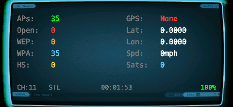

# Wardrive

A wardriving dashboard for the WiFi Pineapple Pager. Captures WiFi networks with GPS coordinates, generates Wigle-compatible CSV files, captures WPA handshakes, and uploads directly to wigle.net.

<p align="center">
  
</p>

## Features

- **Stealth Mode** — Passive beacon capture on monitor interface with channel hopping. No probes sent, covers 2.4GHz + 5GHz + 6GHz on the built-in radio.
- **Active Mode** — Fast AP discovery using `iw scan` on managed interface (2.4GHz only without USB dongle)
- **Raw Beacon Parsing** — Parses 802.11 RSN/WPA Information Elements for accurate encryption detection. Matches the pager's native recon output: `[WPA2-PSK-CCMP128]`, `[WPA3-PSK+SAE-CCMP128]`
- **GPS Integration** — Real-time location from gpsd. Lat, lon, altitude, speed, satellite count.
- **Geiger Counter Sound** — Audio clicks proportional to new AP discovery rate. Faster clicking = more networks.
- **Handshake Capture** — EAPOL detection with rising tone alert. Full pcap saved for later cracking.
- **Wigle CSV** — Append-only real-time CSV. No data loss on battery death.
- **Wigle Upload** — Direct upload to wigle.net via API from the pager
- **Web UI** — Live dashboard, file downloads, and settings at `http://<pager-ip>:8080`
- **Session Management** — Continue previous session or start fresh. Old data archived, never deleted.
- **Screen Timeout** — Auto-dim to save battery. Any button wakes.
- **Themeable** — Uses active Pager UI theme background, or set a custom one

## Installation

```
git clone https://github.com/brainphreak/pineapple_pager_wardrive.git
cd pineapple_pager_wardrive
scp -r wardrive root@172.16.42.1:/root/payloads/user/reconnaissance/
```

## Controls

| Button | Action |
|--------|--------|
| **A** | Start/Stop scan (popup menu) |
| **B** | Settings menu |
| **UP/DOWN** | Navigate menus |
| **GREEN** | Select/confirm |
| **RED** | Back |
| **LEFT/RIGHT** | Adjust values (brightness, cycle options) |

## LCD Dashboard

The main screen shows:

- **Left column**: Total APs, Open, WEP, WPA, Handshakes
- **Right column**: GPS status, Lat, Lon, Speed, Satellites
- **Bottom row**: Channel, Mode (STL/ACT), Elapsed time, Battery %

## Scan Modes

### Stealth (Default, Recommended)

Uses passive monitor mode (`wlan1mon`) with channel hopping. Listens for beacons without sending any probes — invisible to the networks being scanned. Covers all bands (2.4 + 5 + 6GHz) since `wlan1mon` is on the tri-band radio.

### Active

Uses `iw scan` on the managed interface (`wlan0`). Sends probe requests for faster AP discovery but only covers 2.4GHz with the built-in radio. The internal phy#0 radio is 2.4GHz only — use a USB WiFi dongle for 5/6GHz in active mode.

## Settings

Access via **B button** on the LCD or the web UI at port 8080.

<p align="center">
  
  
</p>
<p align="center">
  
  
</p>
<p align="center">
  
</p>

### GPS Settings
- GPS: ON/OFF
- Device: auto-detected serial ports (/dev/ttyACM0, etc.)
- Baud rate: 4800/9600/38400/115200
- Restart gpsd

### Scan Settings
- Mode: Stealth (all bands) / Active (2.4 only)
- Scan interface: managed interfaces (for active mode)
- Monitor interface: monitor interfaces (for stealth + capture)
- Band selection: 2.4GHz, 5GHz, 6GHz toggles
- Handshake capture: ON/OFF

### Wigle
- API credentials status
- Upload individual files or all at once
- Set API credentials via web UI

### Device
- Web server: ON/OFF
- Sound (geiger): ON/OFF
- Brightness adjustment
- Screen timeout: 0/30/60/120/300 seconds

### Data Management
- Clear Wigle files
- Clear captures (pcap)
- Clear hashcat files (.22000)
- Clear database
- Clear all data

## Web UI

Access at `http://<pager-ip>:8080` while wardrive is running.

### Dashboard Tab
- Live stats (auto-refreshes every 5 seconds)
- Recent AP table with BSSID, SSID, auth mode, signal, channel
- Color-coded by encryption type

### Loot Tab
- Download Wigle CSV files
- Download pcap captures for cracking
- Download hashcat .22000 files

### Settings Tab
- Set Wigle API credentials (Name + Token)
- Toggle device settings
- View scan and GPS configuration

## Wigle Upload

1. Create an account at [wigle.net](https://wigle.net)
2. Go to Account > API Token
3. Copy your **API Name** (starts with `AID`) and **API Token**
4. Set them via the web UI at `http://<pager-ip>:8080` > Settings > Wigle API Credentials
5. Upload via LCD: Settings > Wigle > Upload Files or Upload All

GPS coordinates are required for Wigle map visibility. Connect a GPS device before wardriving.

## Data Files

All data is stored in `/mmc/root/loot/wardrive/`:

| Directory | Contents |
|-----------|----------|
| `exports/` | Wigle CSV files (one per session, append-only) |
| `captures/` | Pcap files + hashcat .22000 conversions |
| `wardrive.db` | SQLite database (working buffer for stats) |

Wigle CSV files are written in real-time — no data loss on battery death or crash.

## Bootloader Integration

A launch script for the [Pagerctl Bootloader](https://github.com/pineapple-pager-projects/pineapple_pager_bootloader) is already included in the bootloader repository. Wardrive will automatically appear in the bootloader menu when installed.

## Credits

- **Author**: brAinphreAk
- **WiFi Pineapple Pager**: Hak5

## License

MIT License
